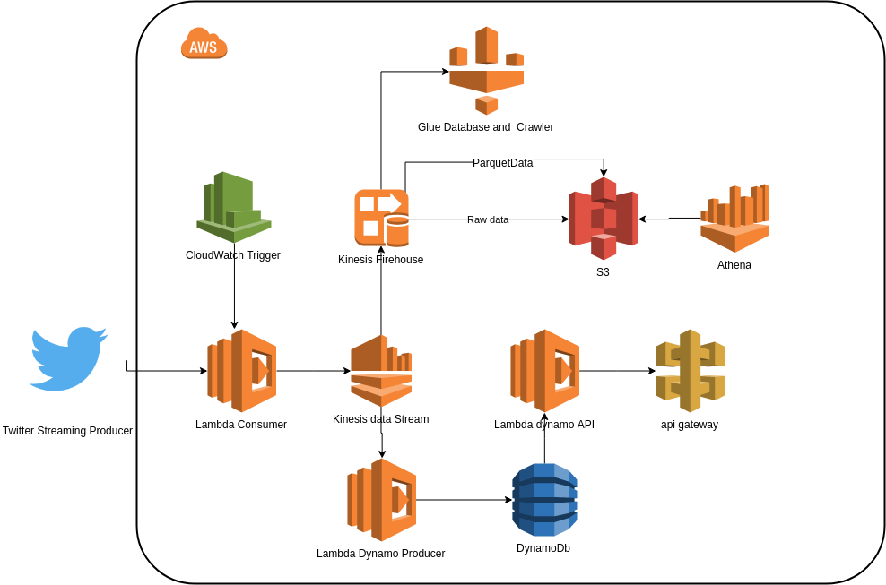

## Data engineer test

##### O teste consistia em criar uma arquitetura onde existisse uma função lambda que consumisse dados da api do Twitter e inserisse esses dados em uma kinesis data-stream, depois deveria ter algo que consumisse dados do data-stream e inserisse os dados no s3 e no dynamoDb, para que o Athena possa consumir do s3 e um api gateway que iria consumir o dynamo db.


#### A minha arquitetura proposta foi a seguinte:


 

<br>
 Como dito anteriormente o primeiro passo foi consumir a API do Twitter para capturar dados, a API escolhida foi a de Streaming do Twitter, por isso o sistema consome apenas o que acontece a partir de ele estar rodando ( nesse caso foi usado a lib Twitthon para abstrair acessos a API).

 Todos os códigos lambda se encontram no caminho ```src/main/python/```

 Foi criado um arquivo chamado App.py dentro deste diretório, esse é um converter de funções, ele que delega quem chamar, o código do arquivo TwitterConsumer.py é quem faz o trabalho mencionado de captura dados da API do Twitter e inserir no Kinesis data stream.

 O kinesis serve como ferramenta de mensageria em tempo real, tudo que é gerado pelo lambda que trás informações do Twitter é enviado para ele.

 Existe um cloudWatch trigger que executa a cada 10 minutos invocando essa função lambda, pq o lambda tem limite de tempo de execução e precisamos executar quase que o tempo todo.

<br>

### primeiro caminho

o primeiro output final é o caminho utilizando firehouse, s3 e glue.

 Este output se baseia em duas saídas, a primeira é apenas um firehouse que conecta no data stream e inseri raw data no s3 diretamente.

 Neste cenário, também queria ter o mesmo dado sendo entregue em parquet para otimizar buscas pelo athena. Por isso, foi criado um glue database e um crawler, este crawler basicamente fica lendo o diretório da raw data acima para criar um schema para converter os dados em parquet para outro firehouse.

 Existe outro firehouse, que converte o raw data em parquet, como configuração ele precisa de um schema no glue para fazer a conversão, é por isso que temos alguns crawlers do glue para fazer isso e utilizarmos como input para esse firehouse, esse firehouse tem como produto final dados em parquet no s3.

 Como final, o Athena pode ler os dados do s3 em parquet, apenas acessando o Athena já temos nossas tabelas criadas pois o Athena herda as tabelas do Glue, então não há necessidade de criar uma tabela no Athena. Uma melhoria que não deu tempo de realizar foi criar um api gateway + lambda para criar uma api em cima do Athena e fazer consultas pela API.

<br>

### Segundo caminho
O segundo caminho (apenas chamando assim, como um alias) é onde existe uma função lambda que consome os dados do kinesis data-stream lê esses dados, faz alguma transformação e envia para o dynamo salvar os dados.

Nesse caso, eu optei para fazer uma simples transformção nos dados para popular a tabela no dynamo com mais sentido, por isso adicionei alguns campos, como um id único que é uma hash da linha, a quantidade de tweets que um usuário fez naquele período espaço tempo, também a data do processamento e data de criação do Tweet no Twitter, e informações do usuário que era o mais importante no contexto. Tudo isso é inserido no dynamo, como uma linha é única e a hash caso venha a ser processada duas vezes o dynamo trata isso junto com a aplicação, onde a hash vai ser a mesma para cada Tweet e sobrescreve os mesmos dados.

O Dynamo tem apenas um indice principal que é o hash_line, único para cada registro. Caso necessite fazer buscas por clientes, vale a pena criar um indíce secundário para o user_id.

Existe também um outro lambda que basicamente faz uma api rest(não é restfull pois optei por não deixar o usuário excluir recursos). Ela basicamente acessa os dados no dynamo e retorna um json com essas informações.

Um API gateway foi criado para fazer a interface entre esta lambda com uma API mesmo, todas as requisições devem bater na API gateway.
<br>
## Como executar

Para a reprodução existe uma infraestrutura como código, todas elas foram escritas com terraform.
<br>
#### dependências
- Terraform
- Conta aws
- Aws cli
- AWs token
- Conta e app Oauth no Twitter
<br>

Primeiro configure seu aws cli em seu terminal, para configurar seu aws cli digite em um terminal ```aws configure```, entre com as suas credencias, access e token da aws e também a região default da aws (ex: us-east-1). Caso não tenha o aws cli, baixe neste [link](https://aws.amazon.com/pt/cli/).

Baixe o terraform para o seu SO, clique [aqui](https://www.terraform.io/downloads.html) 

Entre na pasta ```terraform/production/```
```cd terraform/production/```

Execute o seguinte comando, para iniciar o terraform:

```terraform init```

Depois, execute o comando:

```terraform plan```

No terraform plan, o sistema necessita de algumas variáveis, você pode inclui-lás interativamente pela ferramenta ou na execução pela linha informar elas. As variáveis são:

- twitter_app_key (token do app do twitter)
- twitter_app_secret (token do app do twitter)
- twitter_oauth_token (token do app do twitter)
- twitter_oauth_token_secret (token do app do twitter)
- twitter_filter_subject (qual assunto você deseja filtrar no twitter)

Caso queira executar pela linha de comando com variáveis execute desse jeito:

```
terraform plan \
 -var 'twitter_app_key=suakey'
 -var 'twitter_app_secret=suasecret'
```

Depois, execute o comando:

```terraform apply```

Ele irá toda a infraestrutura para rodar o projeto, o único ponto que ainda não está 100% é que para criar o firehouse que converte em parquet, ele precisa da tabela no glue, e pode ser que ainda não tenha rodado o crawler.

Por isso o arquivo firehouse_parquet_data.tf está comentado, rode a primeira vez sem ele. Depois que a infra subir (passando uns 5-10 min), descomente este arquivo e rode novamente os comandos:

```terraform plan```

Depois, execute o comando:

```terraform apply```

Este parte será repensada para ser mais automaticamente futuramente.

## api reference

A api será deployada pelo api gateway, primeiro pegue o endpoint no console da Amazon

Request
- ```GET```  endpoint/deploying_api/test/

Response

```
{
  "Count": 1,
  "Items": [
    {
      "test": "mingau",
      "hash_line": "jdakmakmdmakd95ui9rji5f"
    }
  ],
  "ScannedCount": 1,
  "ResponseMetadata": {
    "RetryAttempts": 0,
    "HTTPStatusCode": 200,
    "RequestId": "C6VAFM2VHVBDPLG1JLBVJKNDT3VV4KQNSO5AEMVJF66Q9ASUAAJG",
    "HTTPHeaders": {
      "x-amzn-requestid": "C6VAFM2VHVBDPLG1JLBVJKNDT3VV4KQNSO5AEMVJF66Q9ASUAAJG",
      "content-length": "106",
      "server": "Server",
      "connection": "keep-alive",
      "x-amz-crc32": "4174001901",
      "date": "Sat, 02 Feb 2019 19:50:39 GMT",
      "content-type": "application/x-amz-json-1.0"
    }
  }
}
```

Request

- ```POST``` endpoint/deploying_api/test/

Os campos necessários para o post são apenas o hash_line, e qualquer campo que você deseja enviar

Exemplo 

```
    {
            "Item": {
                "processed_date": "algoaqui",
                "hash_line" : "akmkamskiaia",
                "min_created_at": "coloque_algo_aqui", 
                "max_created_df": "coloque_algo_aqui", 
                "tweets_quantity": "coloque_algo_aqui",
                "user_description": "coloque_algo_aqui",
                "user_id": "coloque_algo_aqui",
                "user_location": "coloque_algo_aqui",
                "user_name": "coloque_algo_aqui",
                "user_screen_name": "coloque_algo_aqui",
                "user_url": "coloque_algo_aqui"
            }
    }
```
